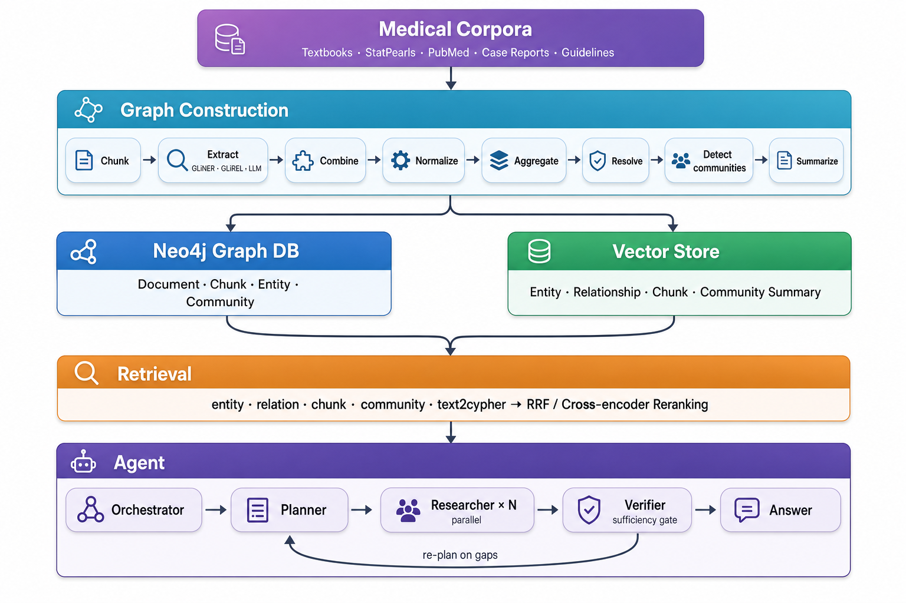
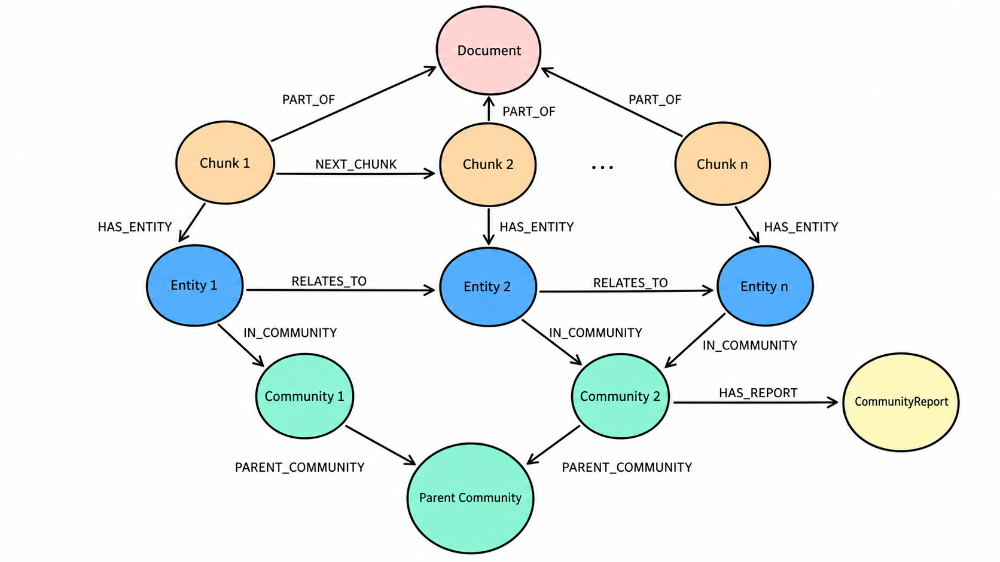

<h1 align="center"><a href="https://github.com/avnlp/agentic-med-diag">Agentic GraphRAG for Medical Diagnosis</a></h1>

<div align="center">

[](https://deepwiki.com/avnlp/agentic-med-diag)
[](https://github.com/avnlp/agentic-med-diag/actions/workflows/ci.yml)
[](https://github.com/avnlp/agentic-med-diag/actions/workflows/ci.yml)
[](https://github.com/avnlp/agentic-med-diag/actions/workflows/ci.yml)
[](https://github.com/avnlp/agentic-med-diag/actions/workflows/ci.yml)
[](https://github.com/avnlp/agentic-med-diag/actions/workflows/ci.yml)
[](https://codecov.io/github/avnlp/agentic-med-diag)
[](https://github.com/avnlp/agentic-med-diag/blob/main/LICENSE)

</div>

This repository implements an Agentic GraphRAG system for Medical Diagnosis. It ingests medical literature, extracts structured clinical knowledge into a Neo4j knowledge graph with hierarchical communities, and answers diagnostic questions through multi-strategy retrieval and an agentic plan–research–verify reasoning loop.

<p align="center">
  
</p>

- **Schema-driven knowledge graph** built from a runtime-injectable schema of medical entity and relation types that drives every extractor, resolver, summarizer, and prompt.
- **Three-extractor fusion** combining GLiNER NER, GLiREL relation extraction, and LLM extraction, merged with configurable union, intersection, max-score, or GLiNER-primary strategies.
- **Two-stage entity resolution** using a deterministic SemHash/MinHash pre-filter followed by clustering, BM25 + cosine candidate retrieval, and LLM deduplication.
- **Hierarchical community detection** using the Leiden algorithm (Graspologic or Neo4j GDS), with LLM-generated community reports summarising each cluster.
- **Four vector collections** (entity, relation, chunk, community) for complementary semantic search.
- **Layered retrieval** combining atomic search methods, pluggable rerankers, and data-only recipes, fused with Reciprocal Rank Fusion or a cross-encoder.
- **Agentic plan–research–verify loop** that decomposes the question, runs parallel researchers over retrieval tools, and gates synthesis on a deterministic sufficiency check.
- **Pluggable storage** with Neo4j for the graph and Qdrant or Weaviate for vectors.

The system is built using:  

- [**GLiNER**](https://github.com/urchade/GLiNER) and [**GLiREL**](https://github.com/jackboyla/GLiREL) for local zero-shot entity and relation extraction.  
- [**Graspologic**](https://github.com/microsoft/graspologic) / [**Neo4j GDS**](https://github.com/neo4j/graph-data-science) for Hierarchical Leiden community detection.  
- [**Neo4j**](https://neo4j.com/) for the persistent knowledge graph with typed nodes, edges, and hierarchical communities.  
- [**Qdrant**](https://qdrant.io/) / [**Weaviate**](https://weaviate.io/) for vector search and hybrid (dense + BM25) retrieval.  
- [**BAML**](https://www.boundaryml.com/) for type-safe, schema-injected LLM functions.  
- [**LangGraph**](https://www.langchain.com/langgraph) for orchestrating the extraction, embedding, and search pipelines.  
- [**DeepAgents**](https://github.com/langchain-ai/deepagents) for the multi-agent reasoning loop.  
- [**ZeroEntropy**](https://www.zeroentropy.dev) for embeddings and reranking.  

## Knowledge Graph

<p align="center">
  
</p>

The system stores everything in a single typed property graph in Neo4j with five node labels (`Document`, `Chunk`, `Entity`, `Community`, `CommunityReport`) and seven edge types:

```
(:Document) <-[:PART_OF]-  (:Chunk) -[:HAS_ENTITY]-> (:Entity:<Type>)
(:Chunk)    -[:NEXT_CHUNK]-> (:Chunk)
(:Entity)   -[:RELATES_TO {type, description, score}]-> (:Entity)
(:Entity)   -[:IN_COMMUNITY]->     (:Community)
(:Community)-[:PARENT_COMMUNITY]-> (:Community)
(:Community)-[:HAS_REPORT]->       (:CommunityReport)
```

### Entities

- An entity carries its `name`, medical `label` (Disease, Drug, …), an optional `description`, an extraction `score`, and free-form `schema_properties`. Its identity is `(name, label)`.
- Resolution later fills in a `canonical_name` and a list of `aliases` (for example, *metformin → metformin HCl, Glucophage*).
- A `provenance` record tracks which extractors produced the entity, the surface forms seen in the text, and the source chunk ids and offsets.

### Relations

- A relation is a directed subject–predicate–object triple (`head → type → tail`) with a `description`, `score`, and properties.
- Before resolution, endpoints are known only by name; resolution links them to canonical entity ids.
- The schema constrains each relation's valid head and tail types - `TREATED_BY` only connects `Disease → {Drug, DrugClass, Procedure}` - which the extractor uses to reject implausible triples.
- All relations persist as generic `:RELATES_TO` edges with the medical type in the `type` property.

### Communities

- After resolution, hierarchical Leiden partitions the resolved relation graph into nested communities. Each `Community` records its level, its parent community, and the entities and relations it contains.
- An LLM generates a `CommunityReport` for each community, bottom-up by level: a title, a summary, structured findings, and a clinical-importance rating. Lower-level reports roll up into higher-level ones.
- Community reports give the agent a thematic, cluster-level view, so a broad question can be answered from a single summary instead of many low-level facts.

### Schema

The schema is a first-class runtime value. It is injected into every extractor, resolver, summarizer, and prompt, and into BAML as dynamic enum types, so the LLM is constrained to the schema rather than merely prompted with it. Each type carries natural-language hints used to steer GLiNER and GLiREL, descriptions used in LLM prompts, and (for relations) the allowed head and tail label sets.

The default schema defines 13 entity types:

1. `Disease`
2. `Drug`
3. `DrugClass`
4. `Symptom`
5. `Pathogen`
6. `AnatomicalStructure`
7. `Procedure`
8. `DiagnosticTest`
9. `RiskFactor`
10. `Gene`
11. `Protein`
12. `Pathway`
13. `MechanismOfAction`

and 25 relation types, grouped by clinical role:

| Group | Relations |
|-------|-----------|
| **Clinical** (disease-centered) | `HAS_SYMPTOM`, `TREATED_BY`, `DIAGNOSED_BY`, `CAUSED_BY`, `HAS_GENETIC_CAUSE`, `AFFECTS`, `HAS_COMPLICATION`, `DIFFERENTIAL_FOR`, `HAS_RISK_FACTOR` |
| **Pharmacological** (drug-centered) | `BELONGS_TO_CLASS`, `TARGETS`, `INHIBITS`, `ACTIVATES`, `METABOLIZED_BY`, `INTERACTS_WITH`, `CONTRAINDICATED_IN`, `CAUSES_ADVERSE_EFFECT`, `MONITORED_BY`, `HAS_MECHANISM` |
| **Molecular** | `ENCODES`, `PARTICIPATES_IN` |
| **Structural** | `IS_A`, `PART_OF`, `INNERVATED_BY`, `SUPPLIED_BY` |

The schema is inspired by SNOMED CT relationship types, the UMLS semantic network, and clinical reasoning patterns.

## Architecture

The system has two data flows: ingestion (text into a knowledge graph and vector store) and retrieval using an agent.

## Ingestion Pipeline

Corpus ingestion streams documents, chunks them, and runs a LangGraph pipeline of graph construction components. State accumulates into a `KnowledgeGraph` that is written to Neo4j and the vector store. The stages run in order:

1. **Extract:** Each chunk is processed by up to three extractors that share the injected schema:
   - **GLiNER** runs batch zero-shot NER, steered by each entity type's natural-language label.
   - **GLiREL** runs zero-shot relation extraction over GLiNER's entity spans, so GLiREL requires GLiNER.
   - **LLM** runs a BAML extraction function with the valid entity and relation types injected as dynamic enums, constraining the model to the schema. Chunks are processed concurrently with bounded concurrency and isolated retries.
2. **Combine:** The three extractor outputs are merged per chunk using a configurable strategy: `union` (superset, merging provenance), `intersection` (only items every extractor found), `max_score` (highest-confidence version), or `gliner_primary` (GLiNER spans supplemented by the LLM).
3. **Normalize:** Within a chunk, entities are deduplicated by `(normalized name, label)` and relations by `(normalized head, normalized tail, type)`, merging sources, surface forms, chunk ids, scores, and properties. Low-confidence and too-short entities are filtered.
4. **Aggregate:** A deterministic, zero-LLM set-union across all chunks collapses the same keys into one cross-chunk candidate set.
5. **Resolve:** Entity and relation-type names are resolved in two stages: a deterministic deduplicator collapses exact and near-exact variants (SemHash, MinHash-LSH) and clusters the residual names; then, within each cluster, BM25 + cosine fusion retrieves candidates and an LLM selects exact duplicates and a single canonical alias. The result writes `canonical_name` and `aliases` onto entities and links relation endpoints to canonical entity ids.
6. **Detect communities:** Hierarchical Leiden runs over the resolved relation graph. Two interchangeable backends share one base class: graspologic-native (default) and Neo4j GDS. The output is a tree of communities with levels and parents.
7. **Summarize:** Communities are walked bottom-up by level; a degree-ranked, token-budgeted context is built for each and passed to an LLM that produces a titled report with structured findings and a clinical-importance rating.

Resolution runs before community detection so the graph is clustered over canonical entities.

## Embedding Pipeline

After graph construction, the embeddable fields of each model are vectorised and upserted into four vector collections.

Source | Text embedded |
--------|---------------|
Entity | canonical name |
Relation | three representations (below) |
Chunk | chunk text |
CommunityReport | report summary |

A single relation is embedded three ways, all keyed by the same relation id, because one vector cannot capture the predicate, the participants, and the full statement at once:

- **Edge fact** - the relation description (for example, *metformin treats type 2 diabetes*).
- **Edge type** - the predicate alone (for example, *TREATED_BY*).
- **Full SPO** - the subject–predicate–object sentence.

Collections support lazy creation, batch upsert, and native vector quantization.

## Retrieval Pipeline

Retrieval uses a layered design: types of search (Vector, Hybrid, Fulltext, BFS) compose into retrievers, which a Search Engine fans out over according to a recipe and fuses with a pluggable reranker.

- **Entity retriever** runs hybrid search over entity names, optionally expanding from the matched seed entities with bounded, degree-aware BFS.
- **Relation retriever** runs hybrid search over the relation collection, then hydrates full edges (head, tail, type, description) from the graph.
- **Chunk retriever** runs hybrid search over raw passages.
- **Community retriever** searches community report summaries for thematic answers.
- **Text-to-Cypher retriever** has an LLM translate the question into a read-only Cypher query against the schema, with few-shot examples and bounded retry.

Recipes are data-only constants that select which methods to run and how to fuse them, so a new strategy requires no orchestration change.

| Recipe | Methods | Reranker |
|--------|---------|----------|
| `entity` / `relation` / `chunk` / `community` | single method | RRF |
| `hybrid_rrf` | entity + relation + chunk + community | RRF |
| `hybrid_cross_encoder` | all four + BFS | cross-encoder |
| `bfs_expand` | entity + BFS | RRF |
| `text2cypher` | text-to-Cypher | RRF |

Results from the recipe's methods are gathered concurrently and fused with Reciprocal Rank Fusion or a cross-encoder reranker. MMR and node-distance rerankers are also available. Fusion degrades gracefully, ignoring any method that returns no results.

## Agentic RAG Loop

The agent is a DeepAgents harness that coordinates three subagents with an orchestrator agent:

- **Planner** decomposes the clinical question into focused sub-questions, each mapped to a retrieval recipe. It has no tools and works from the question text.
- **Researcher** is spawned in parallel, one per sub-question. Each holds the retrieval tools (entity, relation, chunk, community, hybrid, text-to-Cypher search, and a community map-reduce tool) and returns evidence items with citations.
- **Verifier** reads the gathered evidence and returns a structured assessment - a coverage score, an evidence-depth score, missing pieces, targeted follow-ups, and unsupported claims. A deterministic numeric gate decides whether the evidence is sufficient.

When the gate fails, the targeted follow-ups seed another planning round, so the loop converges on missing information rather than repeating searches. When it passes (or iterations are exhausted), the orchestrator synthesises a structured answer with answer text, source citations, a confidence score, clinical caveats, and an answerability flag.

## Structured LLM Output (BAML)

Every LLM interaction outside the agent loop is a typed BAML function with explicit inputs, outputs, retry policy, and provider configuration.

## Datasets

We provide loaders for Medical Question-Answer benchmarks across three evaluation formats.

### MCQ (Exact-Match Accuracy)

| Dataset | Description | Format |
|---------|--------|--------|
| MedQA (USMLE) | USMLE-style clinical vignettes testing broad medical knowledge and diagnostic reasoning. | 4-option MCQ |
| MedMCQA | AIIMS and NEET-PG entrance questions covering medical subjects, topics, and expert explanations. | 4-option MCQ |
| PubMedQA | Biomedical research questions answered from linked PubMed abstracts. | yes/no/maybe |
| MMLU-Med | Medical and biology subset of MMLU covering clinical, anatomy, genetics, and professional medicine topics. | 4-option MCQ |
| MMLU-Pro (Health) | Health-domain professional and biomedical questions from the more challenging MMLU-Pro benchmark. | 10-option MCQ |
| MedXpertQA (Text) | Text-only specialty-board style questions across clinical tasks, specialties, and body systems. | ~10-option MCQ |
| CareQA (MCQ) | English healthcare exam questions derived from Spain's MIR/FSE specialist training exams. | 4-option MCQ |
| NEJM Q&A | Translated Israeli residency board exam questions across clinical specialties. | 4–5-option MCQ |
| PubHealthBench | UKHSA public-health guidance questions grounded in UK government source documents. | 4-option MCQ |
| SuperGPQA-Med | Graduate-level medical knowledge questions from the medicine subset of SuperGPQA. | up to 10-option MCQ |

### Rubric-Scored

| Dataset | Description | Format |
|---------|--------|--------|
| HealthBench | Realistic health conversations with physician-written criteria for safe, complete responses. | Multi-turn rubric-scored conversations |
| RAR-Med | Medical reasoning prompts paired with checklist-style rubrics for structured reward scoring. | Instance-specific rubrics per prompt |

### Open-Ended

| Dataset | Description | Format |
|---------|--------|--------|
| MedCaseReasoning | PMC case-report benchmark for final diagnosis and clinician-aligned reasoning. | Diagnosis from structured case prompts |
| CareQA (Reasoning) | Open-ended English questions rephrased from Spanish MIR/FSE healthcare exams. | Open-ended clinical questions |
| PubHealthBench (Freeform) | Free-text public-health answers grounded in UKHSA guidance documents. | Free-form public-health answers |
| NEJM Diagnostic Reasoning | Open-ended diagnosis generation from full NEJM clinicopathological case records. | Diagnosis from full CPC vignettes |

## Corpora

We provide streaming loaders for medical text corpora.

| Corpus | Description |
|--------|--------|
| USMLE Textbooks | English USMLE preparation textbooks covering core preclinical and clinical medicine. |
| StatPearls | Peer-reviewed point-of-care clinical reference articles from NCBI Bookshelf. |
| PubMed Abstracts | Biomedical literature titles and abstracts from PubMed. |
| PMC Case Reports | Full-text PubMed Central case reports describing patient presentations, workups, diagnoses, and outcomes. |
| Meditron Clinical Guidelines | Clinical practice guidelines from authoritative health organizations for diagnosis, treatment, and care management. |

## Installation

The project uses [uv](https://github.com/astral-sh/uv) for dependency management.

```bash
git clone https://github.com/avnlp/agentic-med-diag.git
cd agentic-med-diag
pip install uv && uv sync
```

## Usage

### Environment Setup

Create a `.env` file with the required credentials. Settings are env-overridable per subsystem, for example:

```env
NEO4J_URI=bolt://localhost:7687
NEO4J_USER=neo4j
NEO4J_PASSWORD=your_password
QDRANT_URL=http://localhost:6333
AGENT_BASE_URL=https://api.openai.com/v1
AGENT_API_KEY=your_api_key
AGENT_MODEL=gpt-5.5
```

### Running the Pipelines

We provide end-to-end pipelines for ingestion and question answering.

```bash
# Ingestion
uv run am-diag-ingest
uv run am-diag-ingest --corpus pubmed,statpearls --batch-size 50

# QA runner
uv run am-diag-qa
uv run am-diag-qa --datasets careqa,medqa --limit 10
```

### Programmatic Usage

Ingest a corpus into the knowledge graph:

```python
from am_diag.loaders.corpus import StatPearlsCorpusLoader
from am_diag.db.graph import create_neo4j_client
from am_diag.vector.embedding import ZembedEmbedder
from am_diag.ingestion import run_corpus_ingestion

report = await run_corpus_ingestion(
    corpus_loader=StatPearlsCorpusLoader(),
    graph_store=create_neo4j_client(),
    vector_store=vector_store,
    embedder=ZembedEmbedder(),
    batch_size=100,
)
```

Search with multi-strategy retrieval:

```python
from am_diag.retrieval import SearchEngine, RetrievalConfig

engine = SearchEngine(
    config=RetrievalConfig(),
    vector_store=vector_store,
    graph_store=graph_store,
    embedder=embedder,
    schema=MEDICAL_GRAPHRAG_SCHEMA,
    reranker=reranker,
)
results = await engine.search("What treats hypertension in chronic kidney disease?",
                              recipe="hybrid_rrf")
```

Answer a clinical question with the agent:

```python
from am_diag.agents import answer_question, AgentSettings

answer = await answer_question(
    "What are first-line treatments for hypertension in a patient with type 2 diabetes?",
    search_engine=engine,
    settings=AgentSettings(),
)
```

## Project Structure

```text
am_diag/
├── common/
│   ├── data_models/        # all data models (Entity, Relation, Community, Chunk, ...)
│   ├── cypher/             # Cypher files
│   └── schema/             # Medical Schema
├── chunking/               # Recursive-character + markitdown chunkers
├── graph_construction/
│   ├── extract/            # GLiNER, GLiREL, LLM extractors + combiner
│   ├── normalize.py        # Per-chunk dedup/normalization
│   ├── aggregate.py        # Cross-chunk set-union
│   ├── resolve/            # Deterministic + cluster + LLM resolution
│   └── community/          # Leiden / GDS detection + Summarization
├── ingestion/              # LangGraph extraction / embedding / search pipelines
├── pipelines/              # End-to-end ingestion + Question Answering
├── db/
│   ├── graph/              # Neo4j client + record serialization
│   └── vector/             # Qdrant / Weaviate stores
├── vector/                 # Embedders + rerankers
├── retrieval/              # methods · retrievers · rerankers · recipes · SearchEngine
├── agents/                 # Agent harness
├── llm/                    # BAML sources + generated client
└── loaders/                # Corpus loaders + Dataset loaders
```

## Contributing

Please see the [CONTRIBUTING.md](CONTRIBUTING.md) for contribution guidelines.

## References

- [Microsoft GraphRAG](https://arxiv.org/abs/2404.16130) - hierarchical communities and community reports
- [Graphiti](https://github.com/getzep/graphiti) - layered graph retrieval and search recipes
- [Cognee](https://github.com/topoteretes/cognee) - DataPoint-based graph memory and ECL pipelines
- [KG-Gen](https://github.com/stair-lab/kg-gen) - knowledge graph extraction with cluster + LLM alias deduplication
- [OptimusKG](https://github.com/mims-harvard/OptimusKG) - biomedical knowledge-graph construction and reasoning
- [YouTu-GraphRAG](https://github.com/TencentCloudADP/youtu-graphrag) - hierarchical agentic graph retrieval
- [LightRAG](https://github.com/HKUDS/LightRAG) - dual-level graph + vector retrieval
- [PathRAG](https://github.com/BUPT-GAMMA/PathRAG) - relational-path pruning over the graph
- [MIRAGE](https://github.com/Teddy-XiongGZ/MIRAGE) / [MedRAG](https://github.com/Teddy-XiongGZ/MedRAG) - medical RAG ablations and corpora
- [MEDITRON-70B](https://arxiv.org/abs/2311.16079) - medical pretraining with the GAP-Replay corpus
- [GLiNER](https://arxiv.org/abs/2311.08526) / [GLiREL](https://github.com/jackboyla/GLiREL) - generalist NER and relation extraction
- [BAML](https://boundaryml.com), [LangGraph](https://www.langchain.com/langgraph), [DeepAgents](https://github.com/langchain-ai/deepagents), [ZeroEntropy](https://www.zeroentropy.dev)

## License

This project is licensed under the Apache License 2.0 - see the [LICENSE](LICENSE) file for details.
